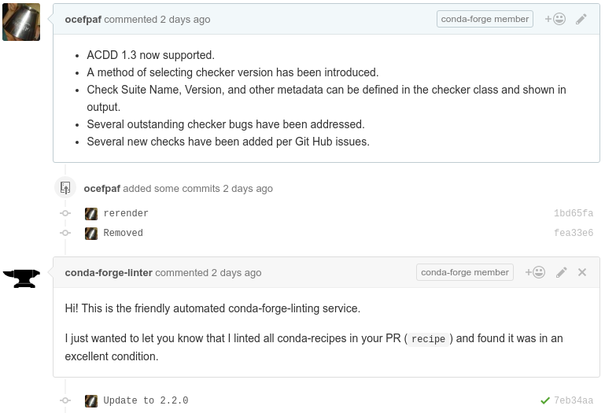
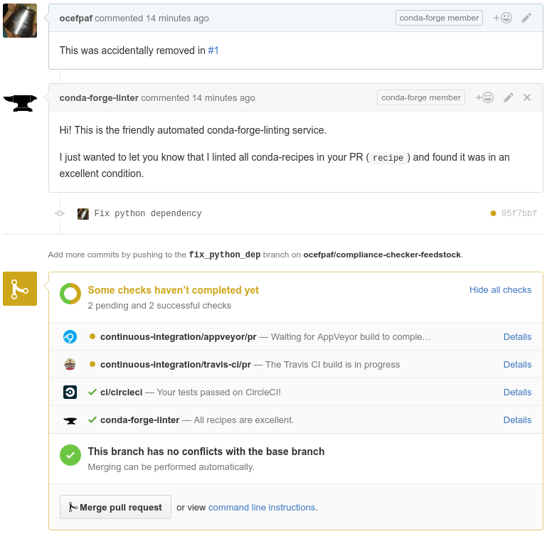

% Conda-forge
% A community powered conda packaging
% May 19th

---

# Who am I?

- [Filipe Fernandes](https://github.com/ocefpaf)
- Involved in the [IOOS conda channel](https://github.com/ioos/conda-recipes/wiki)
- Now deeply involved in the [conda-forge](https://conda-forge.github.io/) community channel

. . .

See [http://wesmckinney.com/blog/conda-forge-centos-moment](http://wesmckinney.com/blog/conda-forge-centos-moment) for more on conda-forge

. . .

(Yeah... Wes was quicker than us to write about it!)

. . .

But we finally got our post out!

[https://www.continuum.io/blog/developer-blog/community-conda-forge](https://www.continuum.io/blog/developer-blog/community-conda-forge)

# The problem

The Python scientific community always wanted a package manager that is cross platform,
does not require sudo, and let's Python be awesome.
The conda package manager solved that problem, but created a new ones.

. . .

> - How do I get software that is not in the `defaults` channel?
> - If I build my own binaries where should I host them?
> - How should I build them to ensure they are compatibly with other systems and the default channel?

# more about the problem

The `defaults` cannot keep up with the pace of the scientific community and many users/communities channels were created to fill in that gap.
That led to duplication of effort, recipe fragmentation,
unstable environments when mixing and matching packages from different channels, etc.

# Let's take a step back: what is a conda channel?

> - Is similar to a Linux repository (or app store)
> - The service is hosted for free at Continuum's Anaconda Cloud
> - We can upload pre-compiled binaries using the `conda` package manager

# Well... What is a conda?

> - An open-source packaging system developed for, and used by, the scientific software community.
> - From their own webpage:
> - "Package Everything!"
> - "And share your repositories with clients or colleagues."


# Why use conda?

> - Reproducible environments are easy to create
> - Better solution than wheels for Python packages that depend on external libraries
> - One recipe for multiple platforms (no `apt-get`, `yum`, `brew`, etc)

. . .

[http://technicaldiscovery.blogspot.com.br/2013/12/why-i-promote-conda.html](http://technicaldiscovery.blogspot.com.br/2013/12/why-i-promote-conda.html)

# The solution

The conda-forge organization was created with to be a transparent,
open, community led organization, to build conda packages and, hopefully,
provide a stable source for packages while reducing the effort duplication and recipe fragmentation.

. . .

While developed to meet the unique needs of scientific software developers,
it is a system that brings features and utilities for the broader developer community.

# What do we mean by community?

Having a community-governed package channel for conda and a community process for submitting, verifying, and storing ~~signed~~ project releases

[https://conda-forge.github.io/](https://conda-forge.github.io/)

# The conda-forge [channel](http://anaconda.org/conda-forge)

> - 70 contributors
> - 474 packages
> - Available platforms are: Linux-64, Windows-32/64, and OS X
> - You can install with `conda install -c conda-forge gdal`

# Builds

> - The recipes are hosted on [GitHub](https://github.com/conda-forge/feedstocks/tree/master/feedstocks)
> - [AppVeyor](http://www.appveyor.com/) &#10139; Windows
> - [Travis-CI](https://travis-ci.org/) &#10139; OSX
> - [CircleCI+Docker](https://registry.hub.docker.com/u/ocefpaf/centos64-conda-obvious-ci/) &#10139; Linux

# [Automation](https://github.com/conda-forge/conda-forge.github.io/tree/master/scripts)

> - The point of entry is [staged-recipes](https://github.com/conda-forge/staged-recipes)
> - The tooling lives in [conda-smithy](https://github.com/conda-forge/conda-smithy)
> - Once the PR is accepted a GitHub team is created based on the maintainers list
> - The maintainers have commit rights only to their own recipes

# [Linter](https://github.com/conda-forge/conda-forge-webservices/tree/master/conda_forge_webservices)


# Issues


# How to use the channel?

```bash
conda config --add channels conda-forge

curl -L http://bit.ly/tutorial -o environment.yml

conda env create environment.yml
```

. . .

That is it!


# The tutorial environment file

```yaml
name: geopython
channels:
    - conda-forge
dependencies:
    - python=2.7
    - jupyter
    - matplotlib
    .
    .
    .
```

# How to contribute?

> - Report problems
> - Request packages or new releases
> - Send PRs adding/fixing packages

. . .

# Submitting a new recipe

> - Fork [https://github.com/conda-forge/staged-recipes](https://github.com/conda-forge/staged-recipes)
> - Submit the PR
> - The recipe will be built and, once merged, it will trigger the feedstock
> - At the feedstock the recipe will be re-built and uploaded to the channel

# Creating a [recipe](https://github.com/conda-forge/staged-recipes/tree/master/recipes/example)
```yaml


package:
  name: example
  version: {{ version }}

source:
  fn: example-{{ version }}.tar.gz
  url: https://pypi.python.org/example-{{ version }}.tar.gz
  md5: 842b44f8c95517ed5b792081a2370da1
  patches:
    - some.patch

build:
  number: 0
  script: script: pip install --no-deps .

requirements:
  build:
    - python
    - pip
  run:
    - python

test:
  imports:
    - example
  commands:
    - example --version

about:
  home: https://example.com/examples/
  license: BSD 3-Clause
  summary: An example package

extra:
  recipe-maintainers:
    - GitHubHandle

```

# The truth about creating recipes

> - `conda skeleton pypi <packages>`
> - [Search](http://anaconda.org/search?q=gsw), download, copy, and paste

# Maintaining recipes in the feedstock

```yaml


package:
  name: example
  version: {{ version }}

source:
  fn: example-{{ version }}.tar.gz
  url: https://pypi.python.org/example-{{ version }}.tar.gz
  md5: 842b44f8c95517ed5b792081a2370da1
  patches:
    - some.patch

build:
  number: 0
  .
  .
  .
```
# Maintenance example part 0: the PR



# Maintenance example part 1: the actual changes


# Maintenance example part 2: provenance



# How to find [us](https://github.com/orgs/conda-forge/people)?

[Github](https://github.com/conda-forge)

[Gitter](https://gitter.im/conda-forge/conda-forge.github.io)

[Mailing list](https://groups.google.com/forum/#!forum/conda-forge)


# Questions?


[http://xkcd.com/1629/](http://xkcd.com/1629/)
